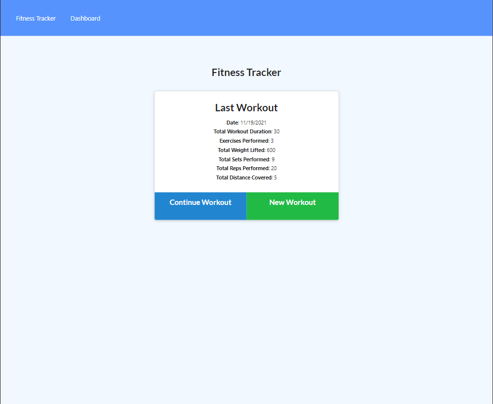
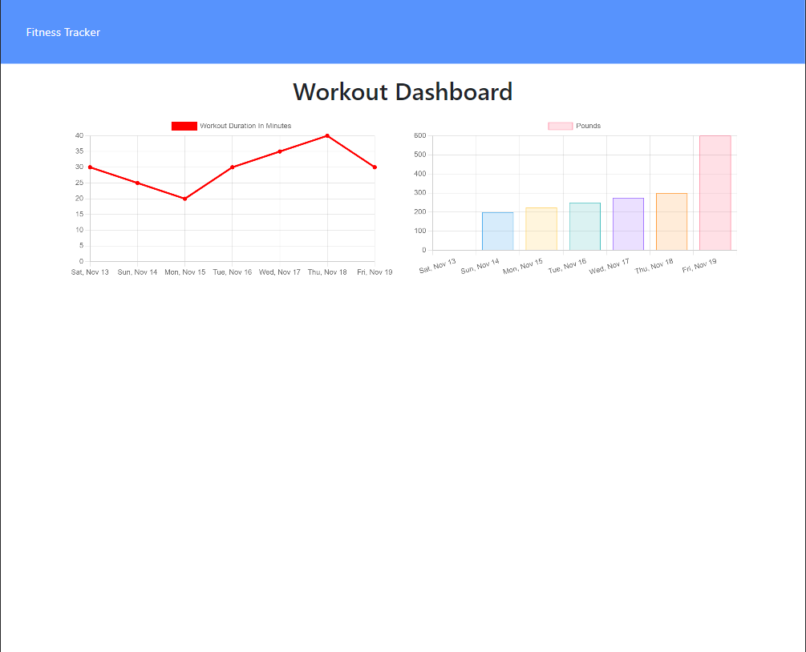
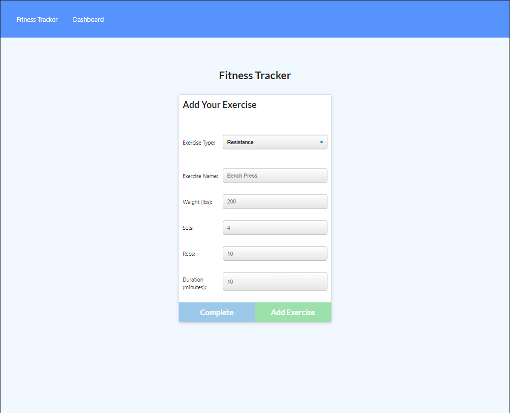

# Workout Tracker

Creating a mongo database that will interact with given front end code to establish a working app.

## Pseudo Code

* I want to be able to view create and track daily workouts
* I want to be able to log multiple exercises in a workout on a given day
* I should also be able to track the name, type, weight, sets, reps, and duration of exercise
* If the exercise is a cardio exercise, I should be able to track my distance traveled.
* User should be able to:
  * Add exercises to the most recent workout plan
  * Add new exercises to a new workout plan
  * View the combined weight of multiple exercises from the past seven workouts on the `stats` page
  * View the total duration of each workout from the past seven workouts on the `stats` page

## Screenshots

